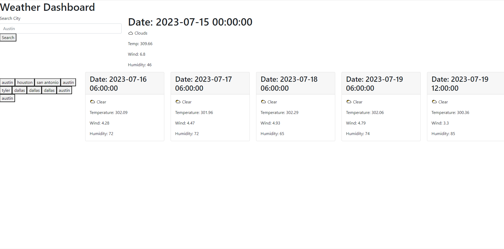

# weather-dashboard

## Description

This webpage allows you to search for a city, and it will give you the temperature, wind, and humidity of the city for the current day, and the next five days. It saves your search history, so when you refresh the page, you'll see previous cities that you have searched for in the left side and you'll be able to click on them to quickly view that city's weather. This website uses the Openweather API to get it's data.

## Installation

You can go to either the repo and download it https://github.com/Rockojoe2/weather-dashboard/tree/main or you can click on this website below.

https://rockojoe2.github.io/weather-dashboard/

## Credits

https://openweathermap.org/ - Used their API
Student files that taught us how to use API's

Classmate May (https://github.com/mayphamx) helped me figure out how to navigate through the API's to get the certain data I needed (temperature, wind, future day, etc).

## License

MIT License

---

